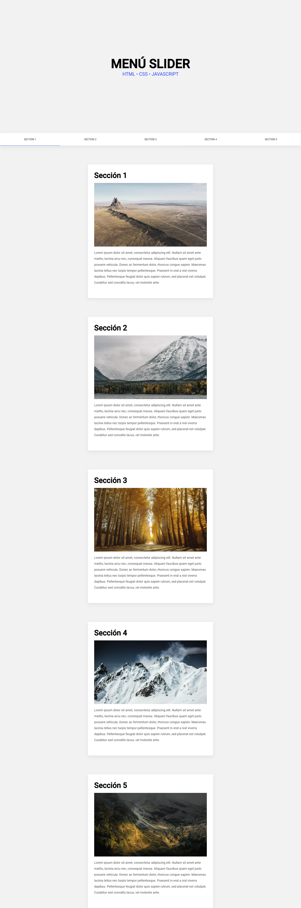

# Menú de Navegación Pegajoso y Animado | HTML, CSS y Javascript

Menú de navegación sticky con una animación del indicador, encho del canal de FalconMasters.

## Demo
- Ver Pagina: [Link a la pagina web](https://sergio-ivan-melgarejo.github.io/slider-nav/)

## Captura de Pantalla

## tutorial de FalconMasters

### [Tutorial: https://youtu.be/06f80GVQ1B8](https://youtu.be/06f80GVQ1B8)